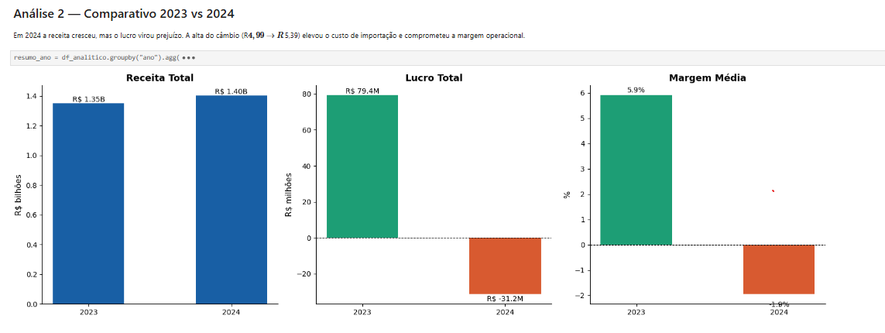
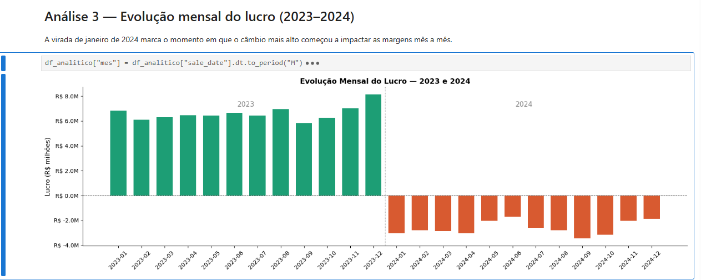
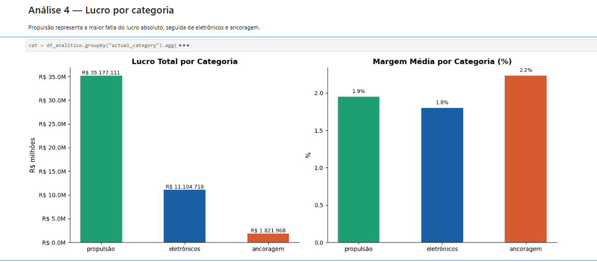
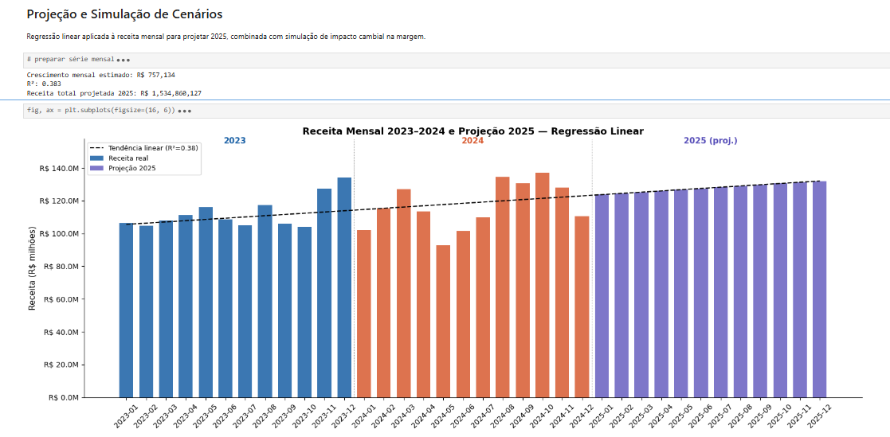
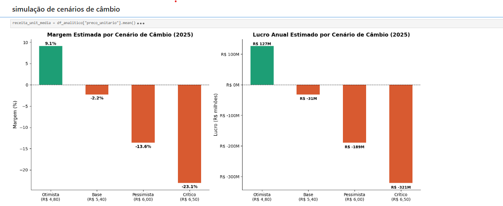

# 📊 Análise de Vendas — Equipamentos Náuticos (2023–2024)

Análise exploratória de **9.895 transações** de vendas de uma empresa de equipamentos náuticos,
cobrindo dois anos completos de operação (2023 e 2024).

O projeto integra quatro fontes de dados distintas, trata inconsistências reais,
calcula métricas de lucro com conversão cambial e projeta a receita de 2025
via regressão linear — além de simular o impacto de diferentes cenários de câmbio na margem.

---

## 🛠️ Tecnologias


---

## 📁 Estrutura do projeto

```
analise-vendas-nautico/
├── README.md
├── notebooks/
│   └── Analise.ipynb        # notebook completo com todo o código
└── IMG/                  # gráficos gerados
    ├── Comparativo_2023_2024.png
    ├── Evolução_mensal.png
    ├── Lucro_categoria.png
    ├── Projeção.png
    ├── Simulação_cambio.png
    ├── Top_produtos.png
    └── Top10_clientes.png
```

---

## 🗂️ Sobre os dados

| Tabela | Registros | Descrição |
|---|---|---|
| `vendas_2023_2024.csv` | 9.895 | Transações com data, produto, cliente, quantidade e valor total |
| `produtos_raw.csv` | 157 | Catálogo com nome, categoria e preço unitário em R$ |
| `clientes_crm.json` | 49 | Cadastro de clientes com localização e e-mail |
| `custos_importacao.json` | 150 | Histórico de custo de importação em US$ por produto (desde 2016) |

---

## 🔧 Tratamentos realizados

- **Clientes:** padronização do campo `location` com formatos inconsistentes, extração de estado e cidade, correção de 30 e-mails com `#` no lugar de `@`
- **Produtos:** normalização de categorias com erros ortográficos e variações de acentuação, conversão do campo `price` de string para float
- **Custos:** explosão de histórico de preços aninhado em JSON, separação entre `custo_final` (mais recente) e `custo_historico` (série temporal)
- **Vendas:** parse de datas em formatos mistos (ISO e brasileiro), verificação de nulos e duplicatas
- **Integração:** merge das 4 tabelas em um único `df_analitico` com validação de integridade

---

## 📐 Métricas criadas

```python
cambio_anual = {2023: 4.994, 2024: 5.394}  # câmbio médio anual — Banco Central do Brasil

df_analitico['receita_unitaria'] = df_analitico['total'] / df_analitico['qtd']
df_analitico['custo_brl']        = df_analitico['usd_price'] * df_analitico['cambio']
df_analitico['lucro_unitario']   = df_analitico['receita_unitaria'] - df_analitico['custo_brl']
df_analitico['lucro_total']      = df_analitico['lucro_unitario'] * df_analitico['qtd']
df_analitico['margem_pct']       = (df_analitico['lucro_unitario'] / df_analitico['receita_unitaria']) * 100
```

> O custo de importação (`usd_price`) está em dólar. A conversão usa o câmbio médio anual
> do Banco Central do Brasil para garantir comparação correta entre os dois anos.

---

## 📈 Principais insights

### Receita cresceu — lucro despencou

Em 2024 a receita subiu **4%**, mas o lucro virou um prejuízo de **R$ 32 milhões**.
A causa: o câmbio passou de R$ 4,99 para R$ 5,39, corroendo toda a margem operacional.



---

### A virada aconteceu em janeiro de 2024

Todos os 12 meses de 2023 foram lucrativos. Todos os 12 meses de 2024 foram deficitários.
A mudança foi abrupta e diretamente ligada à alta do câmbio no início do ano.



---

### Produtos — quem lucra e quem prejudica


---

### Propulsão concentra 74% do lucro total



---

### Top 10 clientes por lucro gerado


---

### Projeção de receita 2025 — regressão linear

A tendência de crescimento da receita aponta **R$ 1,53 bilhão em 2025** (+9% vs 2024),
mas a lucratividade depende inteiramente do câmbio.



---

### Simulação de cenários de câmbio para 2025

Apenas com dólar abaixo de **R$ 5,00** a operação retorna à margem positiva.

| Cenário | Câmbio | Margem estimada | Lucro anual estimado |
|---|---|---|---|
| Otimista | R$ 4,80 | +9,1% | R$ +127M |
| Base | R$ 5,40 | -2,2% | R$ -31M |
| Pessimista | R$ 6,00 | -13,6% | R$ -189M |
| Crítico | R$ 6,50 | -23,1% | R$ -321M |



---

## 🚀 Como rodar

```bash
# instalar dependências
pip install pandas matplotlib scikit-learn

# abrir o notebook
jupyter notebook notebooks/Analise.ipynb
```

---

## 👩‍💻 Autora

Feito por **Lisieux Nunes Fernandez**  
[LinkedIn](https://www.linkedin.com/in/lisieux-nunes) · [GitHub](https://github.com/LisiFernandez)
